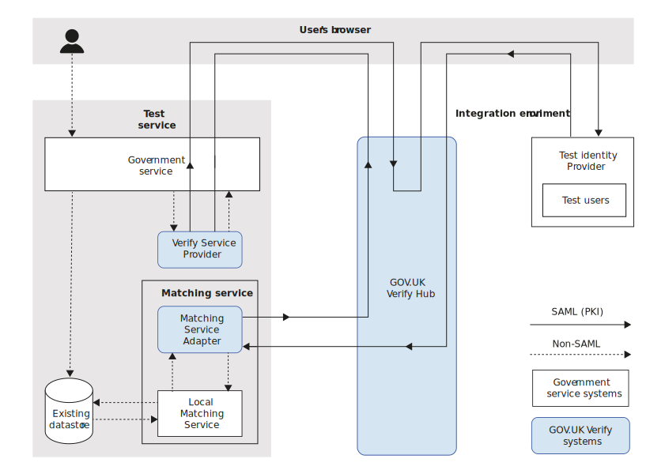

.. _envEndToEndTests:

Run end-to-end testing
=======================

.. warning:: This documentation is out of date. We have published `new technical documentation <https://www.docs.verify.service.gov.uk>`_.

The integration environment accurately reflects hub behaviour in the production environment. You can use the integration environment to test complete user journeys, both success and failure scenarios.

We  advise you to do end-to-end testing in the integration environment as part of your continuous integration pipeline. For more information, see `Testing code <https://www.gov.uk/service-manual/making-software/code-testing>`_ in the Government Service Design Manual.

You must provide a full demonstration of all user journeys as part of your `Stage 4 <http://alphagov.github.io/identity-assurance-documentation/stage4/Stage4.html#stage-4>`_ gate review.

.. important:: If you carry out penetration testing (pen testing) on your end-to-end system, you must not extend this to the hub domain. You must only run penetration tests on your own system. If you think you have a valid reason for running penetration tests in the hub domain, you must first contact GOV.UK Verify support at idasupport@digital.cabinet-office.gov.uk.

This diagram shows the end-to-end testing flow. See below for explanations.

b and test identity providers. The test identity providers contain test users. Step 1: create test users. Step 2: End-to-end testing where you test authentication success and failure, and match or no-match scenarios. Step 3: Tear down where you delete test users.
    :align: center

    End-to-end testing in the integration environment

.. _setupEtoE:

Setup for end-to-end testing
------------------------------

The integration environment is not accredited to use real user data, and it has no links to real identity providers. Carry out business analysis to identify user identities that cause potential problem scenarios during :ref:`matching <matching>`. Then, in the user administration application programming interface (API), create test users that will test these scenarios. You must also add the test users to your local matching datastore in the integration environment.

A test identity provider contains:

* the user administration API – you should have submitted your credentials when you `requested access to the environment <http://alphagov.github.io/rp-onboarding-tech-docs/pages/env/envRequestform.html>`_

* a connection to the hub in the integration environment, which is used for end-to-end testing – no authentication credentials are required

Setup for end-to-end testing involves the following procedures:

 * :ref:`create test users <CreateTestUsers>`

 * :ref:`view test users <view-test-users>`

 * :ref:`delete test users <delete-users>`

.. _CreateTestUsers:

Create test users
~~~~~~~~~~~~~~~~~~~

This procedure describes how to create test users in bulk and load them into the test identity provider. You must add the same test users to your local matching datastore in the integration environment.

Make an HTTP POST to the user administration API with a JSON document containing an array of user data. For example:
::

    curl --user '{username}:{password}' -H 'Content-Type: application/json' -d @create-user.json https://idp-stub-integration.ida.digital.cabinet-office.gov.uk/{idp-name}/users

where:

* ``username`` and ``password`` are your credentials for managing test users
* ``idp-name`` is the name of the test identity provider. Completing a journey in the integration environment will help you find this. On the identity provider page, you'll see your designated ``idp-name`` in the url.
* ``create-user.json`` is the name of the file containing an array of test user data in JSON format, for example:

  ::

    [{
        "pid": "00754148-902f-4d94-b0db-cb1f7eb3fd84",
        "username": "user1",
        "password": "password",
        "firstName": {
            "value": "Fred",
            "verified": true
        },
        "gender": {
            "value": "MALE",
            "verified": false
        },
        "dateOfBirth": {
            "value": "1970-01-01",
            "verified": true
        },
        "address": {
            "verified": true,
            "postCode": "WC2B 6NH",
            "lines": [
                "Aviation House",
                "London"
            ]
        },
        "levelOfAssurance": "LEVEL_2",
        "surnames": [{
            "value": "Smith",
            "verified": true
        }]
    }]

  Possible values are shown in the following table.

  .. csv-table::
   :file: possibleValues.csv
   :header-rows: 1
   :widths: 4, 10

.. _view-test-users:

View test users
~~~~~~~~~~~~~~~~

To view existing test users, GET the users resource from the relevant test identity provider. For example::

    curl --user '{username}:{password}' https://idp-stub-integration.ida.digital.cabinet-office.gov.uk/{idp-name}/users

where ``idp-name`` is the name of the test identity provider.

The test users are returned in JSON format. To view the page you must provide your credentials for managing test users. You create the credentials by submitting the environment access form.

.. _delete-users:

Delete test users
~~~~~~~~~~~~~~~~~~~

To delete test users from the test identity provider, POST a JSON document to the user administration API containing the usernames you want to delete. For example:

::

    curl --user '{username}:{password}' --data '{"username": "user1"}' -H 'Content-Type: application/json'  https://idp-stub-integration.ida.digital.cabinet-office.gov.uk/{idp-name}/users/delete

where:

* ``user1`` is the name of the test user you want to delete
* ``username`` and ``password`` are your credentials for managing test users
* ``idp-name`` is the name of the test identity provider

.. _RunEtoEtest:

Run end-to-end tests
---------------------

As a minimum, test the following end-to-end user scenarios:

* authentication success and authentication failure
* match and no-match
* all the possible outcomes of your matching service, including :ref:`Cycle 3 <cycle3>` and :ref:`user account creation <createnewaccounts>`, if implemented

Tear down
------------

After each integration test run, we recommend that you :ref:`delete the test users <delete-users>`.  Set up each integration test run with newly created test users.

When you've successfully completed testing in the integration environment, you must provide a full demonstration of all user journeys. This is one of the `outputs required at this stage <http://alphagov.github.io/identity-assurance-documentation/stage4/Stage4.html#stage-4>`_ before moving on to `Stage 5 Production Onboarding <http://alphagov.github.io/identity-assurance-documentation/stage5/Stage5.html>`_.
