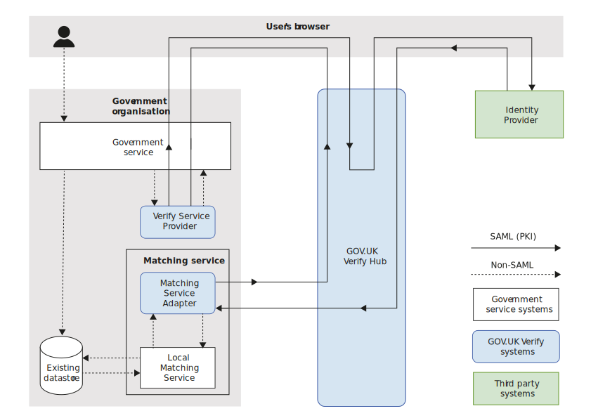

.. _matchingverify:

How matching works with GOV.UK Verify
=================================================

atching service, which is connected to a local matching datastore. Communication between these elements is not via SAML. The text below the image describes all elements in the architecture.

When an identity provider has verified a user’s identity, it generates and sends some limited information about that user’s identity to the service via the Verify Hub.

The GOV.UK Verify Hub sends the information, in SAML, to your service where the :ref:`Matching Service Adapter (MSA) <msaUse>` validates the authenticity of the SAML message and converts it into JSON data.

The MSA then sends the JSON to your :ref:`Local Matching Service <localmatchingservice>`.

The Local Matching Service runs a series of checks to find a possible match in your local datastore(s) and will return:

- no unique match (no match at all or more than one match)
- unique match with one record

Your :ref:`matching strategy <matchingstrategy>` should define what your service should do for each outcome.

You must host both the MSA and the Local Matching Service. Together they are known as a ‘matching service’.
